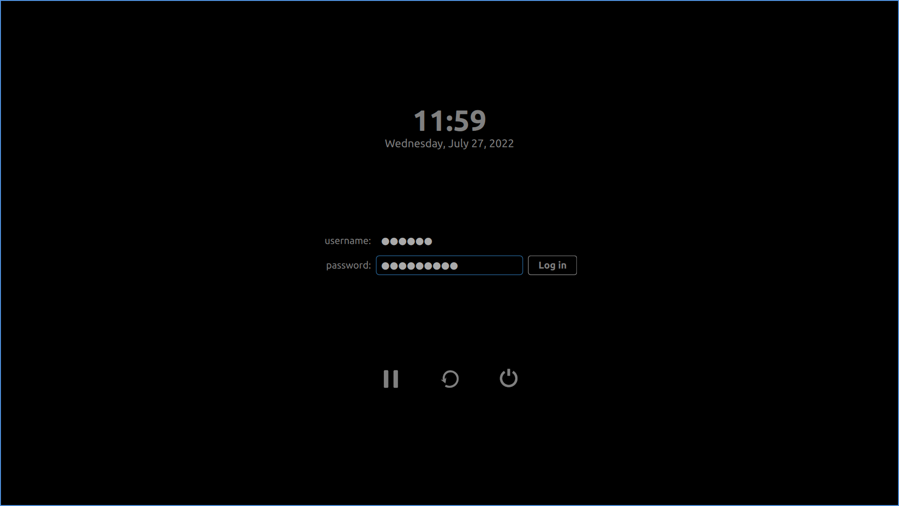

# Minimal theme for SDDM login manager

## Features

- Username and password strings are hidden to avoid accidentally typing in the wrong box and revealing your password
- No session selector (but session index is configurable)
- No layout selector
- No wallpaper
- Most colors are configurable, see bundled `theme.conf`

## Usage

1. `cd /usr/share/sddm/themes/`
1. `mkdir bird`
1. Download the theme files and copy them to `bird/`
1. If you're using an "alternatives" configurator, point it to the newly created directory

## Legal

This work is licensed under the MIT license. See [tldrlegal.com](https://tldrlegal.com/license/mit-license) for what that means.

This theme is based on the `lubuntu` theme by _Lubuntu Artwork Team_ that comes bundled with Lubuntu 22.04, which in turn is based on a theme by _Abdurrahman AVCI_.

## If you can't access your regular session

If you see the theme but it doesn't log you in to the session you want, try adjusting the `sessionIndex` in your copy of `theme.conf`. The easiest way to do this is to boot, wait for the login screen, then press Ctrl + Alt + F2 for terminal access to your machine. Login and navigate to `/usr/share/sddm/themes/bird/`, then use a terminal editor like `nano` to edit `theme.conf`. Save and exit `nano`, then press Ctrl + Alt + F1 to get back to the login screen. Click the Reboot icon and wait for the login screen to appear. Log in as usual, repeat until you get the session you want.
